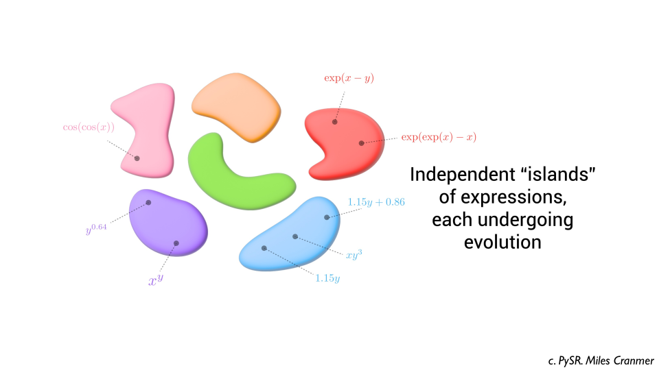

# escher-web

This is the repository that contains source code for the [website for escher](https://github.com/trishullab/escher) hosted on [https://trishullab.github.io/escher-web/](https://trishullab.github.io/escher-web/).


This is the general workflow I follow to convert a slide deck into a scrollytelling website:

2. Export slide decks as PDF files `static/escher-slides.pdf`.
3. `brew install pdf2svg` and then run `static/extract-slides.sh` which defines the logic to extract each slide into folders with relevant frames.

4. Open `index.html` and edit the content to match the slide deck. Here is how the directory of frames integrates into a scrollytelling section:
  ```html
<section class="section">
  <div class="container">
    <h2 class="title is-2">Heading</h2>
    <!-- ID helps scrollama identify which section to update -->
    <div class="columns is-centered" id="pysr">
      <div class="column is-max-mobile is-max-tablet is-max-desktop is-max-widescreen article">
        <h3 class="title is-size-6-mobile is-size-4-tablet">Sketch of PySR's search space</h3>
        <div class="content is-size-7-mobile is-size-6-tablet has-text-left step">
        ...
        </div>
        <!-- More sections like this for each image. -->
      </div>
      <!-- Image. -->
      <div class="column content">
        <!-- Change to point to the correct folder. -->
        
      </div>
    </div>
  </div>
</section>

<!-- More sections like this for each folder of frames. -->
<!-- At the end -->
<script>
  // Use mobile layout.
  mobileCorrections();
  // Init scrollable sections.
  init("#scientific-discovery");
  // This is the ID of the section we just defined.
  init("#pysr");
  init("#lasr-learning-loop");
  init("#lasr-results");
</script>
  ```


Check out the source code for COSMOS and LaSR's website for similar examples. Available here:
 - [https://trishullab.github.io/cosmos-web/](https://trishullab.github.io/cosmos-web/)
  - [https://trishullab.github.io/lasr-web/](https://trishullab.github.io/lasr-web/)